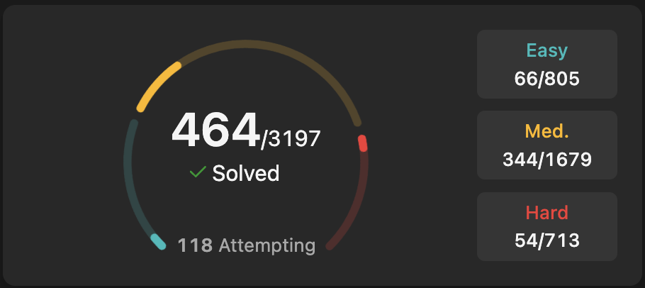

# Leetcode Practice

This is a repository for learning and practicing programming.
I make a new practice class when my IDE starts to lag, which is usually at
around 4000 lines.

06/24 Progress:
 

 
05/24 Progress:
 

